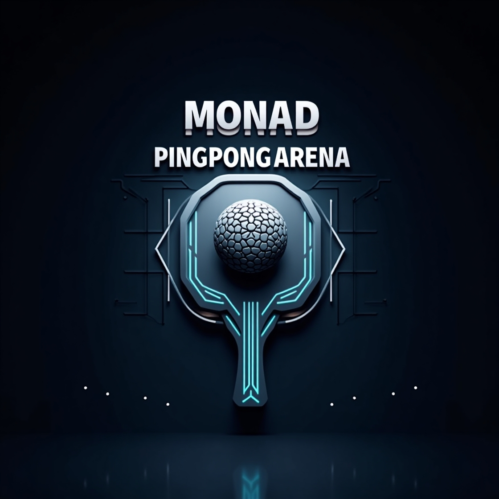

# 🚀 Monad PingPong Arena

> Where blockchain meets competitive gaming - stake MON, battle opponents, collect NFTs with real utility, and climb the leaderboard in this Web3 arcade revolution.

---


Create an engaging blockchain game leveraging Monad's high-performance smart contract platform**

---

## 🎯 Objective

Monad PingPong Arena bridges the gap between traditional gaming and Web3 by creating an intuitive, skill-based game with meaningful digital ownership. It solves the problem of disconnected gaming experiences by introducing NFTs with actual utility, verifiable match results, and fair competition mechanics.

The project serves both traditional gamers looking for new experiences and crypto enthusiasts seeking engaging applications beyond speculation. By implementing a balanced economy with peer-to-peer trading and skill-based rewards, it demonstrates Monad's capabilities for gaming applications through fast transactions, low fees, and scalable smart contracts.

---

## 🧠 Myself & Approach

### Solo Developer:
- Arpit Patel

### My Approach:
- **Why we chose this problem**: Gaming represents one of the most promising adoption vectors for blockchain technology. By creating an engaging, skill-based game with meaningful NFT integration, we can demonstrate Monad's capabilities while providing genuine value to users.

- **Key challenges addressed**:
  - Implementing real-time P2P multiplayer without a dedicated server
  - Creating NFTs with actual gameplay utility rather than just cosmetics
  - Designing a fair competition system with verifiable results
  - Building an intuitive UI that appeals to both traditional gamers and crypto users

- **Breakthroughs during development**:
  - Developed a hybrid approach for game result verification that balances on-chain integrity with user experience
  - Created an efficient attribute encoding system for on-chain NFT metadata
  - Implemented a fair admin verification system for match results with actual score display

---

## 🛠️ Tech Stack

### Core Technologies Used:
- **Frontend**: React, TypeScript, TailwindCSS, Vite
- **Blockchain**: Solidity, ethers.js
- **Real-time Multiplayer**: PeerJS (WebRTC)
- **Storage**: On-chain storage for game results as well as for NFT metadata
- **Hosting**: Vercel

### Sponsor Technologies Used:
- [✅] **Monad:** Smart contracts for game creation, joining, NFT minting and marketplace functionality. Implemented on-chain storage for game results, NFT metadata, and player statistics.

---

## ✨ Key Features

- ✅ **Real-time Multiplayer Ping Pong Game**: Smooth, responsive gameplay with P2P connection using WebRTC

- ✅ **NFT Integration with Gameplay Utility**:
  - Paddle NFTs with attributes (power, spin control, durability)
  - Player avatar NFTs with cosmetic and utility features
  - Visual effect NFTs (trails, ball skins) with on-chain metadata

- ✅ **Blockchain-Verified Match Results**:
  - Transparent match history with verifiable outcomes
  - Admin verification system showing actual game scores
  - Fair winner declaration mechanism

- ✅ **NFT Marketplace**: Buy, sell, and trade game assets with other players

- ✅ **Stake-Based Competitive Play**: Stake MON tokens on matches for added excitement



*The game features an attractive UI with real-time responsive controls, and blockchain integration.*

---

## 📽️ Demo & Deliverables

- **Demo Video Link:** [Monad Ping Pong Arena Demo (Youtube)](https://youtu.be/CEihnOZ1iQM)
- **Live Demo:** [Deployed Link](https://monad-pingpong-arena.vercel.app)
- **Explorer Link:** [Contract Address (View on MONAD Explorer)](https://testnet.monadexplorer.com/address/0x88282cc7c75c3726c7e09e73954dc34bff8731dc)
---

## ✅ Tasks & Bonus Checklist

- [✅] **Member of the team completed the mandatory task - Followed at least 2 of our social channels and filled the form**
- [✅] **Member of the team completed Bonus Task 1 - Sharing of Badges and filled the form (2 points)**
- [✅] **Member of the team completed Bonus Task 2 - Signing up for Sprint.dev and filled the form (3 points)**

---

## 🧪 How to Run the Project

### Requirements:
- Node.js v16+ and npm
- MetaMask or another Ethereum wallet with Monad Testnet configured
- Monad Testnet MON for transactions (available from faucet)

### Local Setup:
```bash
# Clone the repo
git clone https://github.com/arpit15006/Monad-PingPong-Arena.git

# Install dependencies
cd Monad-PingPong-Arena
npm install

# Start development server
npm run dev
```

### Connecting to Monad Testnet:
1. Add Monad Testnet to your MetaMask (Chain ID: 10143, RPC URL: https://testnet-rpc.monad.xyz/)
2. Get test MON from the Monad faucet
3. Connect your wallet to the application

---

## 🧬 Future Scope

- 🎮 **Enhanced Gameplay Mechanics**: Add power-ups, different game modes, and tournaments
- 🏆 **Tournament System**: Implement bracket-based tournaments with prize pools
- 🌐 **Cross-Chain Compatibility**: Allow NFTs to be used across different blockchain games
- 📱 **Mobile Application**: Develop native mobile apps for iOS and Android
- 🤝 **Social Features**: Add friends, messaging, and team play options
- 🔄 **NFT Crafting System**: Combine NFTs to create more powerful or unique items

---

## 📎 Resources / Credits

- **PeerJS**: WebRTC library for peer-to-peer connections
- **ethers.js**: Ethereum library for blockchain interactions
- **Monad Testnet**: For blockchain infrastructure and testing

---

## 🏁 Final Words

Building Monad Ping Pong Arena has been an exciting journey into the intersection of gaming and blockchain technology. The most rewarding aspect was creating a system where players can stake their tokens and compete for real rewards, all while owning and trading unique NFTs.

The biggest challenge was implementing a fair and transparent match result verification system that balances on-chain integrity with user experience. By developing a hybrid approach with admin verification showing actual game scores, we've created a solution that maintains the benefits of blockchain while addressing its limitations.

I believe this project demonstrates the potential of Monad for gaming applications and hope it inspires more developers to build engaging, skill-based games on the blockchain.

---
